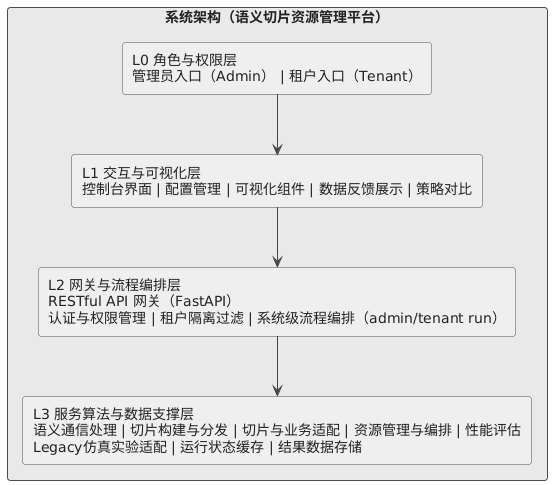
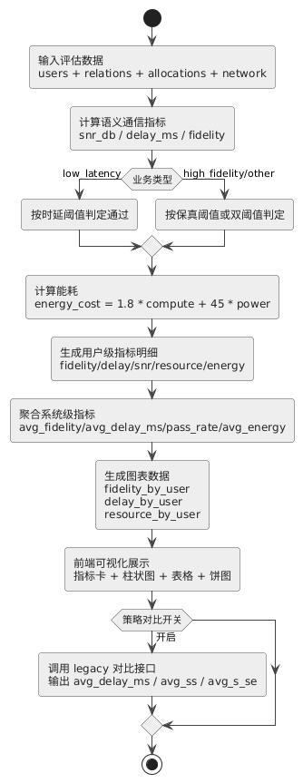

# 语义通信网络切片系统中期报告（系统开发版）

## 摘要
本课题面向“语义通信 + 网络切片 + 多租户资源编排”场景，基于前后端分离架构完成了一个可运行的工程化平台。系统已支持管理员/租户双角色、业务配置、网络配置、切片构建与分发、业务-切片适配、资源分配、性能评估与可视化，以及 SemSlice / NetSlice / Random 三策略对比。  
本阶段重点不是单一算法复现，而是“把算法能力落地成可配置、可观测、可扩展的系统”，已形成完整 API 链路、模块解耦服务层、legacy 兼容适配层和前端控制台。

---

## 1. 研究背景（依据开题方向扩写）

### 1.1 背景问题
随着 6G 与智能网络的发展，通信系统目标正从传统“比特级可靠传输”向“任务级语义有效传输”演进。传统网络切片主要面向带宽、时延、吞吐等指标进行资源隔离与调度，但在语义通信场景下，仅依靠底层链路指标已难以直接反映业务体验：  

1. 同样带宽下，不同业务语义价值密度差异明显；  
2. 不同领域知识库对语义恢复质量影响显著；  
3. 多租户并发时，切片策略与资源策略耦合，传统静态分配难以兼顾时延与语义保真。

因此，本课题聚焦“语义感知切片 + 动态资源编排”的系统化实现，目标是在工程层面构建可复现实验平台，支撑策略对比、参数调优和后续算法迭代。

### 1.2 研究意义
从工程与应用角度，本课题具有以下价值：  

1. **系统价值**：将语义通信、切片、编排、评估整合为统一平台，打通“配置—决策—执行—评估”闭环；  
2. **实验价值**：支持源仓库策略接入与对比，降低“论文算法难复现”的工程门槛；  
3. **应用价值**：面向多租户、差异化业务需求（低时延/高保真）提供可解释的资源调度结果；  
4. **扩展价值**：当前先做文本模态，为后续图像/视频语义扩展预留接口。

### 1.3 与开题目标的对应关系
开题阶段强调“语义通信与网络切片协同优化”的研究主线；中期阶段已在工程上落实为：

1. 语义处理模块可输出 SNR、时延、保真估计；  
2. 切片模块可按知识库与编解码器生成切片实例；  
3. 编排模块支持在线 PSO 与 legacy 实验后端双路径；  
4. 评估模块可量化对比 Delay / SS / S-SE / Energy；  
5. 前端可视化可直接展示关键指标并完成策略对比。

---

## 2. 国内外研究现状与本课题定位

### 2.1 研究现状概述
语义通信研究近年来集中在三条线：

1. 语义编解码器设计（模型结构、鲁棒性、跨模态）；  
2. 信道与语义联合优化（链路条件与语义质量耦合建模）；  
3. 语义网络切片与资源保障（将语义 KPI 引入切片生命周期）。

网络切片研究则更偏向传统 QoS/QoE 指标管理，语义层指标接入仍处于探索阶段。当前多数工作在“算法仿真脚本”层面，缺少面向多角色、多模块协同的工程化平台。

### 2.2 本课题定位
本课题不重复造轮子做“全新模型训练”，而是聚焦**系统工程化与实验可复现性**：

1. 把已有语义/切片策略封装为标准服务接口；  
2. 把算法输入输出规范化，形成统一数据模型；  
3. 把单点脚本升级为可视化可运维的前后端系统。

---

## 3. 课题目标与中期完成情况

### 3.1 总体目标
构建一个语义通信切片控制平台，实现以下能力：

1. 业务、网络、切片参数可配置；  
2. 业务与切片自动适配；  
3. 资源分配可切换多种策略；  
4. 性能指标可量化、可视化；  
5. 支持管理员/租户双系统。

### 3.2 中期完成情况与模块实现
围绕“语义处理—切片构建—资源编排—性能评估—可视化对比”的端到端主线，当前阶段已形成可运行的系统能力：

1. **语义处理模块可输出 SNR、时延、保真估计**，为后续决策提供统一量化输入。  
2. **切片模块可按知识库与编解码器生成切片实例**，并输出可追踪的切片结构。  
3. **编排模块支持在线 PSO 与 legacy 实验后端双路径**，兼顾工程可用与实验复现。  
4. **评估模块可量化对比 Delay / SS / S-SE / Energy**，形成统一指标口径。  
5. **前端可视化可直接展示关键指标并完成策略对比**，形成配置到评估的交互闭环。  

在此基础上，模块级实现细节如下。

#### 3.2.1 认证与权限模块
该模块负责建立管理员与租户双角色运行边界，保证系统在多租户场景下的访问安全与数据隔离。对应实现位于 `backend/app/services/auth_service.py`。  
具体实现包括：  
1. 构建账号字典与会话字典，完成轻量级登录态管理；  
2. 对 `Bearer Token` 进行统一解析、校验与失效处理；  
3. 通过 `ensure_role` 实现管理员/租户接口权限控制；  
4. 在 API 路由层统一接入依赖注入鉴权逻辑，避免重复校验代码。  

#### 3.2.2 语义通信处理模块
该模块负责把“业务语义需求”转为可量化的通信质量指标，为后续切片与资源编排提供统一输入。对应实现位于 `backend/app/services/semantic_service.py`。  
具体实现包括：  
1. 业务配置自动补全，支持默认用户画像与文本模态参数；  
2. 信道场景映射机制（`factory_indoor` / `satellite_link` / `urban_macro`）；  
3. 语义指标估计流程：编码等级选择、SNR 估计、传输时延计算、保真度计算；  
4. 输出用户级语义度量结果，供切片适配与性能评估模块直接消费。  

#### 3.2.3 切片构建与分发模块
该模块负责把管理员定义的切片与知识库配置转化为可执行的切片实例，并输出可追踪分配结构。对应实现位于 `backend/app/services/slicing_service.py`。  
具体实现包括：  
1. 根据切片数量、编解码器数量与知识库配置生成切片实例；  
2. 建立切片与知识库绑定关系（`kb_type / knowledge_level`）；  
3. 支持按策略进行分发并输出 `assignment` 映射；  
4. 形成后续“切片-业务适配”可直接使用的结构化输入。  

#### 3.2.4 切片与业务适配模块
该模块负责把用户业务请求映射到最优切片，是连接语义建模与资源分配的关键环节。对应实现位于 `backend/app/services/adaptation_service.py`。  
具体实现包括：  
1. `similarity` 模式：基于领域匹配、知识水平与需求偏置综合评分；  
2. `domain` 模式：优先按领域直连匹配，并保留兜底策略；  
3. 知识不匹配时触发降权处理，避免错误优先分配；  
4. 输出用户-切片-编解码器关联关系表，供资源分配模块使用。  

#### 3.2.5 资源管理与编排模块
该模块负责在带宽、功率、计算与能耗约束下完成资源分配决策，是系统性能优化的核心模块。对应实现位于 `backend/app/services/orchestration_service.py`。  
具体实现包括：  
1. 在线 PSO 分配路径：用户级带宽/功率/计算联合优化；  
2. 规则分配路径：支持 `weighted / equal / latency_first` 多策略切换；  
3. legacy 实验路径：6 维粒子优化并调用 `evaluate_legacy_vector` 评估；  
4. 能耗约束机制：`energy_cost = 1.8*compute + 45*power`；  
5. 统一输出 `allocations / used / remaining / timeline`，便于评估与可视化。  

#### 3.2.6 性能评估与可视化模块
该模块负责把资源分配结果转化为可比较、可解释的性能指标，并完成前端可视化呈现。对应实现位于 `backend/app/services/evaluation_service.py` 与 `frontend/app.js`。  
具体实现包括：  
1. 核心指标计算：`avg_fidelity`、`avg_delay_ms`、`pass_rate`、`avg_energy`；  
2. 用户级指标明细与图表数据结构生成；  
3. 前端展示柱状图、表格、剩余资源扇形图与策略对比图；  
4. 支持从“单次运行结果”到“多策略对比结果”的统一可视化输出。  

#### 3.2.7 legacy 适配与策略对比模块
该模块负责对接原始实验脚本，保证论文基线实验可复现，并支持多策略横向对比。对应实现位于 `backend/app/services/legacy_adapter.py`。  
具体实现包括：  
1. 动态加载 `DeepSC-master` 脚本与 `main_compute`；  
2. 支持 `paper_sim / legacy / hybrid` 三种运行模式；  
3. 输出统一结构：`avg_delay_ms`、`avg_ss`、`avg_s_se` 与任务级点集；  
4. 为中期实验与结题对比提供一致的数据出口。  

---

## 4. 系统需求分析（开发视角）

### 4.1 功能性需求
本系统的功能需求按照“配置管理—语义处理—切片适配—资源编排—评估展示”主链路进行定义，既保证管理员侧的全局治理能力，也保证租户侧的按需运行能力。  

1. 支持管理员配置全局网络与切片模板；  
2. 支持租户提交业务需求并执行局部运行；  
3. 支持语义处理、切片构建、适配、分配、评估独立调用；  
4. 支持一键全流程运行；  
5. 支持策略对比与结果可视化导出。  

#### 4.1.1 模块化功能需求分解
1. **认证与权限管理需求**  
系统应支持管理员与租户双角色登录，完成身份认证、会话管理和接口权限控制。管理员负责维护全局网络参数与切片模板，租户仅可访问本租户业务数据与运行结果。系统应在接口调用阶段自动执行权限校验与租户范围过滤，避免越权访问和跨租户数据泄露。  

2. **业务配置需求**  
系统应支持用户数量、业务需求类型（高保真与低时延）、业务领域类型、租户标识等基础参数配置，并支持两种输入方式：一是手工导入用户清单，二是按规则自动生成用户集合。系统应对输入参数进行格式校验与缺省补全，确保后续模块可直接消费。  

3. **网络配置需求**  
系统应支持计算能力、总带宽、总功率、能耗阈值、信道场景等网络参数配置，并形成统一网络约束对象。该对象应在语义估计、资源分配、性能评估等阶段复用，保证各环节口径一致。管理员修改网络参数后，应可即时生效并用于下一轮运行。  

4. **切片配置与知识库管理需求**  
系统应支持切片数量、切片命名、编解码器数量、知识库集合等配置，并自动完成切片实例构建。每个切片应具备可追踪标识、关联编解码器、关联知识库、知识领域类型和知识水平等核心属性。系统应支持切片模板的统一维护与多轮复用。  

5. **语义通信处理需求**  
系统应依据业务语义需求与网络场景参数完成语义通信估计，输出信噪比、传输时延、语义保真度等指标。系统应支持不同场景下的差异化计算，并通过统一指标结构输出结果，为切片适配与资源编排提供量化输入。  

6. **切片与业务适配需求**  
系统应支持“相似度匹配”和“领域优先匹配”两种适配方式。适配过程应综合业务领域、知识水平和需求偏置进行评分；当知识库领域与业务领域不一致时，应执行降权处理；当不存在同领域切片时，应提供兜底分配策略，确保流程不中断。  

7. **资源分配与编排需求**  
系统应支持三类资源分配路径：在线优化分配、规则分配、实验复现实验后端分配。分配过程应同时满足带宽、功率、计算和能耗约束，输出用户级分配结果、系统已用资源、系统剩余资源和分配过程时间线，支撑后续评估与追踪分析。  

8. **性能评估与结果展示需求**  
系统应输出核心性能指标（平均保真度、平均时延、通过率、平均能耗）和用户级明细指标，并支持可视化展示。前端应提供指标卡、柱状图、明细表和剩余资源饼图，帮助用户快速判断运行效果、定位瓶颈并比较不同配置方案。  

9. **策略对比与实验复现需求**  
系统应支持三种策略的横向对比，输出平均时延、平均语义得分、平均语义效率以及任务级结果点集。对比结果应可用于中期阶段的实验验证与结题阶段的数据论证，保证实验链路可复现、可复核、可解释。  

### 4.2 非功能性需求
1. **可扩展性**：服务层按模块拆分，方便后续替换算法；  
2. **可复现性**：legacy 适配层保留原脚本调用路径；  
3. **可维护性**：统一数据模型，前后端接口清晰；  
4. **可观测性**：返回 `used/remaining/timeline` 便于排障与分析。

---

## 5. 系统架构设计（按 5 层逐层展开）

### 5.1 架构总览
本系统采用前后端分离架构，图形表达为“客户端—业务逻辑层—数据层”三大区块；在实现逻辑上进一步细化为 5 层，便于逐层说明职责与实现细节。  

图 2 系统架构图（本项目）

5 层逻辑划分如下：  
1. **L0 角色与权限层**：管理员/租户双系统、会话与权限边界；  
2. **L1 交互与可视化层**：参数录入、流程触发、图表展示与策略对比；  
3. **L2 API 网关与编排层**：鉴权、租户隔离、接口编排、统一出入参；  
4. **L3 语义切片与资源算法层**：语义建模、切片构建、适配、资源分配、评估；  
5. **L4 数据与实验支撑层**：运行状态、结果归档、legacy 脚本与对比实验支撑。  

### 5.2 L0 角色与权限层（做了什么）
1. 账号体系区分 `admin` 与 `tenant` 两类角色，登录返回 Token 与角色上下文；  
2. 管理员接口（网络配置、切片配置、管理员一键运行）进行角色强校验；  
3. 租户接口自动做租户范围过滤，仅保留本租户用户、适配关系与分配结果；  
4. 管理员维护全局网络与切片模板，租户运行时默认继承全局模板，保证多租户边界清晰。  

### 5.3 L1 交互与可视化层（前端怎么做）
前端采用模块化控制台设计，围绕“配置—运行—评估—对比”组织交互，主要实现如下：  
1. **九面板导航**：登录、业务配置、网络配置、切片配置、业务适配、资源分配、性能评估、策略对比、系统输出；  
2. **角色驱动界面**：管理员专属面板（网络/切片）在租户模式自动隐藏；  
3. **链路触发方式**：支持模块单步执行与一键全流程执行；  
4. **可视化方式**：指标卡片、柱状图、资源占用表、剩余资源饼图、策略对比表；  
5. **状态反馈机制**：全局状态条 + 各模块状态提示，展示执行阶段与结果摘要。  

该层完成了“输入参数结构化、过程状态可见化、结果指标图表化”的人机交互闭环。

### 5.4 L2 API 网关与编排层（系统流程怎么组织）
L2 负责把前端动作路由为后端可执行流程，并统一接口契约。  
1. **模块级接口**：业务配置、网络配置、切片配置、适配、资源分配、性能评估；  
2. **系统级接口**：`/system/admin/run` 与 `/system/tenant/run`，串联完整流水线；  
3. **编排顺序**：业务配置 -> 切片适配 -> 资源分配 -> 性能评估；  
4. **统一输出结构**：每个阶段均返回可追踪结果，便于前端直接渲染与调试定位。  

### 5.5 L3 语义切片与资源算法层（核心实现）

#### 5.5.1 语义通信实现
语义通信部分不是“只算链路 SNR”，而是将语义质量与链路状态联合建模。  
1. **输入要素**：用户业务需求、领域类型、基线相似度、负载符号数、传输距离、网络场景噪声参数；  
2. **语义编码等级选择**：按语义 NASSI 指标映射编码等级（高语义需求对应更高编码等级）；  
3. **链路与时延估计**：基于功率/带宽/距离/噪声计算 SNR，再据容量模型估计传输时延；  
4. **语义保真估计**：综合基线相似度、SNR 增益、编码增益与时延惩罚得到最终保真度；  
5. **场景化建模**：支持工厂室内、卫星链路、城市宏站三种场景，噪声与距离因子可切换。  

#### 5.5.2 切片构建与知识匹配（含“知识不匹配”处理）
本系统切片采用“**配置驱动的静态切片 + 语义驱动的动态匹配**”联合设计。  

1. **静态切片定义阶段**（管理员侧）  
管理员先给出 `slice_count / slice_names / codec_count / knowledge_bases`。系统根据配置生成 `SliceInstance`：每个切片包含切片 ID、切片名、绑定编解码器、知识库 ID、知识库领域类型与知识水平。该阶段输出的是“可被调度的候选切片集合”。  

2. **动态切片适配阶段**（运行时）  
系统对每个用户遍历全部候选切片，计算用户-切片匹配分数并选择最优切片，输出 `user -> slice` 的关系表供后续资源分配使用。  

3. **匹配评分函数**  
对用户 `u` 与切片 `s`，适配分数定义为：  
`score(u,s) = 0.55*domain_match + 0.35*knowledge_level + requirement_bonus + latency_bonus`  
其中：  
`domain_match = 1.0`（领域一致）或 `0.45`（领域不一致）；  
`requirement_bonus = 0.10`（高保真）或 `0.05`（低时延）；  
`latency_bonus = 0.10`（低时延业务且切片知识水平 >= 0.85）否则为 0。  

4. **知识不匹配处理机制**  
当用户业务领域与切片知识库领域不一致时，系统不会直接报错，而是通过 `domain_match` 降权惩罚（`1.0 -> 0.45`）降低该切片的被选概率，实现“可运行但低优先级”的鲁棒处理。  

5. **兜底策略与稳定性**  
在 `domain` 适配模式下，若不存在同领域切片，系统回退为选择知识水平最高切片，避免出现“无可分配切片”导致流程中断。  

6. **切片设计目标**  
该设计在工程上同时满足三点：  
1) 支持管理员按业务场景快速定义切片模板；  
2) 支持租户运行时按语义需求自动匹配最优切片；  
3) 在知识不匹配和配置不完备场景下保持流程可执行。  

#### 5.5.3 资源分配设计（怎么分配资源）
资源分配支持在线编排与 legacy 复现实验两条主路径。  
1. **在线 PSO 路径**：  
   - 决策变量为每个用户的带宽、功率、计算资源；  
   - 约束总带宽、总功率、总计算和总能耗阈值；  
   - 目标函数综合低时延/高保真效用，并加入公平性与违约惩罚；  
   - 输出用户级资源分配表与全过程时间线（used/remaining/timeline）。  
2. **规则分配路径**：`weighted/equal/latency_first` 三种模式，通过用户需求类型与适配相似度加权后归一化分配；  
3. **Legacy 复现实验路径**：以 6 维资源向量为核心进行优化，调用 legacy 评估接口，兼顾历史策略复现与现系统指标约束；  
4. **能耗约束收敛**：采用统一能耗模型 `energy_cost = 1.8 * compute + 45 * power`，若超阈值则按比例回缩计算资源。  

#### 5.5.4 性能评估设计
1. 用户级指标：保真度、时延、SNR、带宽、功率、计算、能耗；  
2. 核心汇总指标：`avg_fidelity`、`avg_delay_ms`、`pass_rate`、`avg_energy`；  
3. SLA 判定：低时延业务以时延阈值为主，高保真业务以保真阈值为主；  
4. 评估结果直接回流前端图表，实现可解释的策略比较。  

### 5.6 L4 数据与实验支撑层（落地与复现）
1. **运行状态缓存**：维护最近一次系统运行结果，支持状态查询与调试回看；  
2. **结果数据归档**：保存策略对比与实验日志，支撑中期/结题数据整理；  
3. **legacy 脚本支撑**：保留原实验链路调用能力，支持 semslice / netslice / random 对比。  

### 5.7 端到端流程总结（与架构一一对应）
1. L0 完成身份认证与权限判定；  
2. L1 收集业务/网络/切片参数并触发运行；  
3. L2 进行租户过滤并编排调用链；  
4. L3 依次执行语义建模、切片匹配、资源分配、性能评估；  
5. L4 保存状态与结果，最终将指标反馈给 L1 可视化层。  

---

## 6. 技术栈与工程选型

| 层级 | 组件 | 技术 |
| --- | --- | --- |
| 前端 | 控制台页面 | HTML5 / CSS3 / Vanilla JS |
| 网关 | API 服务 | FastAPI / Uvicorn |
| 数据模型 | 请求与响应约束 | Pydantic |
| 算法计算 | 在线优化与向量运算 | NumPy |
| 兼容适配 | 旧脚本动态加载 | importlib / sys.path |
| legacy 依赖 | 源仓库实验调用 | TensorFlow / Torch / bert4keras / sklearn |
| 图表与报表 | 对比图生成 | 前端自绘 + Python 脚本 |

工程上采用“最小可运行依赖”策略：核心链路可不依赖 heavy 模型训练即可完成流程验证；当需要严格复现实验时切换到 legacy 后端。

---

## 7. 核心接口与数据流

### 7.1 核心 API
1. `POST /api/v1/module/business/config`  
2. `POST /api/v1/module/network/config`  
3. `POST /api/v1/module/slice/config`  
4. `POST /api/v1/module/adaptation`  
5. `POST /api/v1/module/resources/allocate`  
6. `POST /api/v1/module/performance/evaluate`  
7. `POST /api/v1/system/admin/run` / `POST /api/v1/system/tenant/run`  
8. `POST /api/v1/analysis/legacy/strategy-compare`

### 7.2 流程图与用例图
- 系统流程图：`docs/diagrams/system_flow.puml` / `docs/diagrams/system_flow.png`  
- 用例图：`docs/diagrams/use_case.puml` / `docs/diagrams/use_case.png`  
- 资源分配流程图：`docs/diagrams/allocation_flow.mmd`

系统流程采用“登录鉴权—配置准备—语义切片—资源分配—性能评估—可视化反馈”的顺序组织，关键细节如下。  

1. **鉴权与租户隔离阶段**：管理员维护全局网络与切片模板；租户运行时只保留本租户用户与分配结果。  
2. **语义建模阶段**：根据用户业务需求、领域类型、传输距离和信道场景估计 `snr_db / delay_ms / fidelity`。  
3. **切片匹配阶段**：基于“领域匹配 + 知识水平 + 需求偏置”计算适配分数；出现知识不匹配时触发降权；若无同领域切片则回退到知识水平最高切片。  
4. **资源分配阶段**：在总带宽、总功率、总计算、总能耗阈值约束下，执行在线 PSO 或规则分配或 legacy 路径，统一输出 `allocations + used/remaining + timeline`。  
5. **评估与展示阶段**：计算 `avg_fidelity / avg_delay_ms / pass_rate / avg_energy`，并在前端以指标卡、柱状图、表格和剩余资源饼图展示。  

用例层面围绕管理员与租户两类角色展开：管理员承担系统治理和全局参数维护，租户承担业务提交与效果验证。两类角色共享运行、评估和策略对比能力，但在网络配置、切片配置等全局操作上保持权限隔离。该设计同时满足“多租户边界清晰”和“实验流程可复现”两类目标。  

### 7.3 性能分析指标设计与评估方法实现（补充）

#### 7.3.1 指标体系设计
系统采用“用户级 + 系统级 + 策略对比级”三层指标体系。  

| 指标层级 | 指标项 | 含义 |
| --- | --- | --- |
| 用户级 | `fidelity`、`delay_ms`、`snr_db`、`bandwidth`、`power`、`compute`、`energy_cost` | 单用户语义通信质量与资源占用 |
| 系统级 | `avg_fidelity`、`avg_delay_ms`、`pass_rate`、`avg_energy` | 全局平均性能与达标情况 |
| 策略对比级 | `avg_delay_ms`、`avg_ss`、`avg_s_se` | SemSlice/NetSlice/Random 横向比较 |

#### 7.3.2 核心计算公式与口径
1. 信噪比（SNR）：
`snr_db = 10 * log10( P / (B*10^6*d^2*N0) )`，其中 `N0 = 10^(noise_dbm/10) * 10^-3`。  

2. 传输时延：
`C = B*10^6*log2(1+10^(snr_db/10))`，  
`delay_ms = payload_symbols * 30 / C * 10^3`。  

3. 语义保真度：
`fidelity = clip(base_similarity + 0.018*(snr_db-3) + encoder_gain - delay_penalty, 0, 1)`，  
其中 `encoder_gain ∈ {0.08, 0.04, 0.01}`，  
`delay_penalty = max(0, (delay_ms-130)/1300)`。  

4. 能耗模型：
`energy_cost = 1.8 * compute + 45 * power`。  

5. 核心汇总：
`avg_fidelity = mean(fidelity_i)`，  
`avg_delay_ms = mean(delay_i)`，  
`avg_energy = mean(energy_i)`，  
`pass_rate = mean(pass_i)`。  

6. SLA 判定口径：  
评估函数支持 RT/HF/默认三档门限；当前业务类型映射下主要采用默认双阈值判定（`fidelity >= 0.55` 且 `delay_ms <= 180`）计算通过率。  

#### 7.3.3 评估方法实现流程
图 3 性能评估实现流程图

1. 输入阶段：接收业务用户、切片适配结果、资源分配结果与网络场景参数；  
2. 计算阶段：按用户逐个计算 `snr_db / delay_ms / fidelity`，再计算能耗与是否通过；  
3. 聚合阶段：汇总系统级核心指标与图表数据结构；  
4. 展示阶段：前端将结果映射为指标卡、柱状图、表格和剩余资源饼图；  
5. 对比阶段：调用 legacy 对比接口输出三策略统计值与任务级点集。  

#### 7.3.4 指标与可视化映射关系
1. 指标卡片：`avg_fidelity / avg_delay_ms / pass_rate / avg_energy`；  
2. 用户保真柱状图：`charts.fidelity_by_user`；  
3. 用户时延柱状图：`charts.delay_by_user`；  
4. 资源明细表与剩余资源饼图：`used_resources + remaining_resources`；  
5. 策略对比图：`avg_delay_ms / avg_ss / avg_s_se` 与任务级时延表。  

### 7.4 接口设计

#### 7.4.1 设计原则
1. 统一前缀：接口统一挂载在 `/api/v1` 下，便于版本管理与路由归类。  
2. 统一协议：前后端通过 `HTTP + JSON` 交互，输入输出结构保持稳定。  
3. 统一鉴权：除登录和健康检查外，核心业务接口均需身份校验。  
4. 统一隔离：租户模式自动进行租户范围过滤，保证数据边界。  
5. 统一输出：模块接口与系统接口均返回结构化结果，支持可视化直接渲染。  

#### 7.4.2 接口分组
1. 认证与会话接口：登录、登出、当前会话查询。  
2. 配置接口：业务配置、网络配置、切片配置。  
3. 算法链路接口：适配、资源分配、性能评估。  
4. 系统编排接口：管理员一键运行、租户一键运行。  
5. 对比与复现实验接口：三策略对比、单策略 legacy 运行。  

#### 7.4.3 核心接口清单
1. `POST /api/v1/auth/login`  
2. `POST /api/v1/auth/logout`  
3. `GET /api/v1/auth/me`  
4. `POST /api/v1/module/business/config`  
5. `POST /api/v1/module/network/config`（管理员）  
6. `POST /api/v1/module/slice/config`（管理员）  
7. `POST /api/v1/module/adaptation`  
8. `POST /api/v1/module/resources/allocate`  
9. `POST /api/v1/module/performance/evaluate`  
10. `POST /api/v1/system/admin/run`（管理员）  
11. `POST /api/v1/system/tenant/run`  
12. `POST /api/v1/analysis/legacy/strategy-compare`  
13. `POST /api/v1/workflow/run-legacy`  

#### 7.4.4 关键输入输出设计
1. 资源分配接口输出：`allocations`、`used_resources`、`remaining_resources`、`timeline`。  
2. 性能评估接口输出：`core_metrics`、`user_metrics`、`charts`。  
3. 系统一键运行接口输出：`business_output`、`network_output`、`slicing_output`、`adaptation_output`、`allocation_output`、`performance_output`。  
4. 策略对比接口输出：场景、资源向量、策略摘要、任务级结果点集。  

#### 7.4.5 权限与错误处理设计
1. 管理员拥有全量接口访问权限；租户不可调用管理员专属配置接口。  
2. 租户调用资源分配与性能评估时，仅返回本租户相关数据。  
3. 典型错误码：`400`（请求参数错误）、`401`（未登录或令牌失效）、`403`（权限不足）、`422`（字段校验失败）、`500`（服务内部错误）。  

---

## 8. 算法与实验结果（中期）

### 8.1 仿真参数设置

#### 8.1.1 全局网络与资源参数
1. 总功率与总带宽约束采用 `P_total=1`、`B_total=2`（legacy 脚本与后端默认网络配置一致）。  
2. 三策略对比统一使用 6 维资源向量 `resource_vector=[0.2,0.3,0.5,0.6,0.8,0.6]`（前三维为切片功率，后三维为切片带宽）。  
3. 符号开销采用 `k_symbol=10`，用于计算语义频谱效率 `S-SE=SS/k_symbol`。  
4. 语义与时延判定阈值采用 `sim_threshold=0.6`、`delay_threshold=0.13s`（即 130ms）。  
5. 前后端在线链路默认约束同时包含 `cpu_capacity=100` 与 `compute_energy_threshold=500`，用于资源编排与能耗约束。  

#### 8.1.2 切片类型与编解码器配置
1. 切片数固定为 3（`slice-1/2/3`），编解码器固定为 3（`codec-1/2/3`），文本模态为主。  
2. 语义切片脚本中，编解码器由语义匹配等级触发：`sem_NSSAI>=95 -> slice-1`，`85<=sem_NSSAI<95 -> slice-2`，其余进入 `slice-3`。  
3. 后端切片配置层支持知识库类型与知识水平联合建模，默认知识库为 `animal/music/sports`，知识水平为 `0.92/0.88/0.86`。  
4. 网络切片与无切片基线都复用同一组编码器模型，保证比较时“模型能力”一致，仅改变策略。  

#### 8.1.3 场景与任务规模
1. `fitSNR`：10 任务规模，对应 `en/en90/en80 = 4/3/3`。  
2. `fit5TASK`：5 任务规模，对应 `en/en90/en80 = 2/2/1`。  
3. `fit15TASK`：15 任务规模，对应 `en/en90/en80 = 6/5/4`。  
4. 数据口径统一来自 Europarl 测试集与对应词表：`test_data_en.pkl / test_data-en90%.pkl / test_data-en80%.pkl`。  

### 8.2 仿真策略与算法设计（统一优化目标）

#### 8.2.1 总体优化目标
本课题不是“网络切片一个优化问题、语义切片一个优化问题”的并列关系，而是**同一个总体目标下的三种策略实现**。总体目标可表述为：  
在统一资源约束下（功率、带宽、计算与能耗），最大化语义收益（`SS`、`S-SE`）并最小化业务时延（`Delay`），同时满足任务通过条件（高保真任务满足相似度阈值、低时延任务满足时延阈值）。

#### 8.2.2 三策略在同一目标下的实现差异
1. `NetSlice`（传统网络切片）  
不进行语义知识驱动的切片选择，只在传统资源域做分配（带宽/功率为主，在线版本附带计算资源）；legacy 脚本入口为 `net_slice_random_SS*`，优化入口为 `pso_netslice_random_SS_fit*`。  
2. `SemSlice`（语义感知切片）  
先按语义匹配度选择切片与编解码器，再在资源域联合分配（带宽/功率/计算），即“语义编解码器选择 + 资源分配”协同；legacy 脚本入口为 `sem_slice_SS*`，优化入口为 `pso_semanslice_SS_fit*`。  
3. `Random/NoSlice`（无切片基线）  
不使用确定性切片策略，任务到编码器采用随机方式，资源采用固定或等权方式，作为最低复杂度对照；对应脚本为 `no_slice_random_SS*` 与 `no_slice_random_KPI_fit*`。  

#### 8.2.3 前后端策略映射
1. 前端通过 `allocation_algorithm` 触发策略，后端在 `orchestration_service.py` 中统一映射：`semslice / netslice / noslice`。  
2. legacy 对比接口在 `legacy_adapter.py` 中统一封装为 `compare_legacy_strategies(scenario, resource_vector)`，保证三策略在同场景同资源下对比。  
3. 中期对比图由 `docs/scripts/generate_algorithm_comparison.py` 在 `paper_sim` 模式统一生成。  

### 8.3 指标设计

#### 8.3.1 策略对比主指标
1. 平均时延：`avg_delay_ms`。  
2. 平均语义得分：`avg_ss`。  
3. 平均语义频谱效率：`avg_s_se`。  

#### 8.3.2 系统级补充指标
1. 平均语义保真度：`avg_fidelity`。  
2. 业务通过率：`pass_rate`。  
3. 平均能耗：`avg_energy`。  

#### 8.3.3 指标判定口径
1. 高保真业务（`HF/high_fidelity`）按语义阈值判定通过：`fidelity >= 0.6`。  
2. 低时延业务（`RT/low_latency`）按时延阈值判定通过：`delay <= 130ms`。  
3. 所有策略使用同一判定口径，确保横向比较公平。  

### 8.4 仿真结果与分析

结果文件：
- `docs/figures/algorithm_comparison_full.png`
- `docs/figures/algorithm_comparison_full.csv`

| 场景 | 策略 | 平均时延(ms) | 平均SS | 平均S-SE |
| --- | --- | ---: | ---: | ---: |
| fitSNR | semslice | 65.9022 | 0.8443 | 0.0846 |
| fitSNR | netslice | 77.4896 | 0.7720 | 0.0774 |
| fitSNR | random | 92.9428 | 0.6660 | 0.0666 |
| fit5TASK | semslice | 59.7316 | 0.8914 | 0.0891 |
| fit5TASK | netslice | 74.0494 | 0.8000 | 0.0802 |
| fit5TASK | random | 87.6339 | 0.6887 | 0.0687 |
| fit15TASK | semslice | 69.2510 | 0.8112 | 0.0814 |
| fit15TASK | netslice | 82.8175 | 0.7298 | 0.0730 |
| fit15TASK | random | 98.9540 | 0.6258 | 0.0627 |

分析结论如下：  
1. 三个场景中，`SemSlice` 都是最优，说明“语义编解码器选择 + 资源协同分配”在同约束下最有效。  
2. 相比 `NetSlice`，`SemSlice` 的时延下降约 `15%~19%`，`SS` 与 `S-SE` 提升约 `9%~12%`。  
3. 相比 `Random/NoSlice`，`SemSlice` 的时延下降约 `29%~32%`，`SS` 与 `S-SE` 提升约 `27%~30%`。  
4. 任务规模从 `5 -> 15` 增加时，三策略时延均上升、语义指标均下降；但 `SemSlice` 的退化斜率最小，鲁棒性更好。  

---

## 9. 中期工程产出清单

### 9.1 代码产出
1. 前后端分离系统主干代码；  
2. 6 个核心服务模块；  
3. 多角色鉴权与租户隔离逻辑；  
4. legacy 实验适配层与三策略对比接口。

### 9.2 文档与图件产出
1. 系统架构图（PlantUML + Mermaid）；  
2. 系统流程图、用例图、算法逻辑图；  
3. 资源分配流程图；  
4. 性能对比图与数据 CSV；  
5. `.puml` 批量导出脚本：`docs/scripts/export_puml_png.ps1`。

---

## 10. 当前问题与风险分析

1. legacy 依赖较重，跨环境部署成本高；  
2. 当前性能评估仍以规则建模与仿真为主，真实网络数据接入不足；  
3. 仅完成文本模态，图像/视频尚未接入；  
4. 多目标优化超参数仍需系统化调优。

---

## 11. 后续工作计划

### 11.1 近期计划（中期后）
1. 完善实验参数扫描与对比自动化；  
2. 增加更细粒度日志（每轮 PSO 收敛曲线、约束触发次数）；  
3. 补充接口级回归测试与数据一致性测试；  
4. 优化前端图表交互（筛选、导出、截图）。

### 11.2 结题阶段计划
1. 引入更多业务场景与租户规模压力测试；  
2. 扩展多模态接口定义（图像/视频）；  
3. 梳理论文实验章节，形成“系统实现 + 对比实验 + 复杂度分析”完整闭环。

---

## 12. 结论
本课题中期阶段已完成从“算法脚本”到“系统平台”的关键跨越：  
一方面，语义通信切片核心流程已工程化落地；另一方面，策略对比、可视化与可复现能力已建立，为后续深入实验和论文撰写奠定了稳定基础。整体进度符合开题目标，下一阶段将重点提升实验深度和结果说服力。
